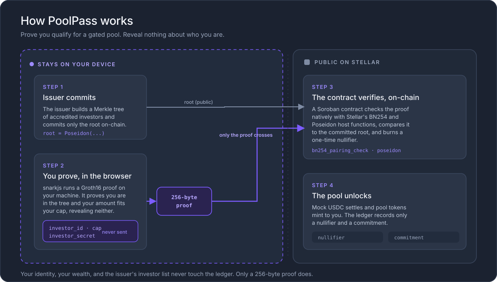
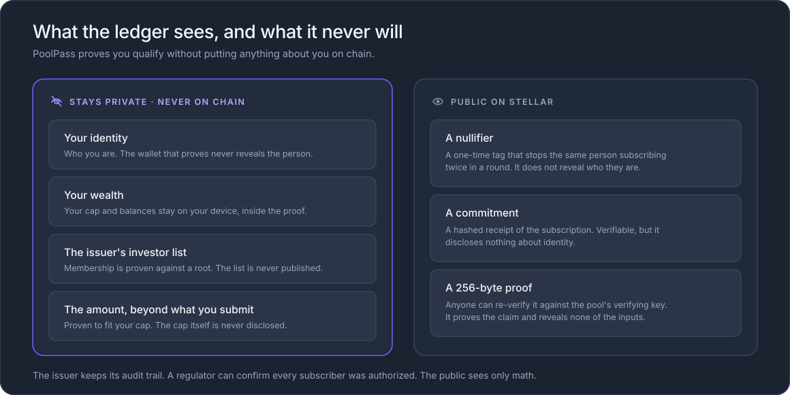
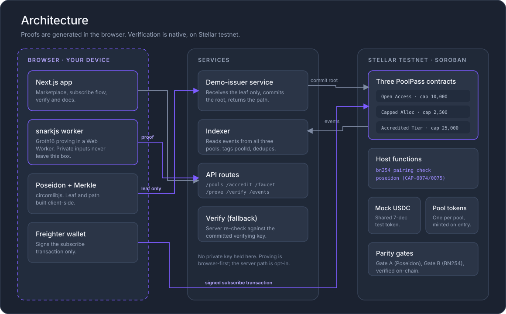

# PoolPass

Private accreditation proofs for gated real-world-asset pool subscriptions on Stellar.

[**Live app: usepoolpass.xyz**](https://usepoolpass.xyz)

[](https://stellar.expert/explorer/testnet)
[](https://developers.stellar.org/docs/build/smart-contracts)
[](https://docs.circom.io/)

## The problem

Accreditation usually requires an investor to send identity documents, financial records, or a place on a private allowlist to every issuer they approach. That creates duplicate stores of sensitive data. It also makes a public wallet easy to connect to a real person and their financial position.

## The solution

PoolPass lets an issuer commit an accredited set as one Merkle root. An investor proves in their browser that they belong to that set and that their subscription amount is within their private cap. The PoolPass contract verifies the Groth16 proof on Stellar before settling Testnet USDC and minting the pool token. The investor's identity, cap, secret, and Merkle path never enter the transaction.



## What stays private and what becomes public

Private inputs remain in the browser: investor identity, private cap, secret, Merkle path, and the issuer's full accredited list. Public inputs are limited to the Merkle root, subscription amount, epoch, and a one-time nullifier. The wallet and amount are public because settlement occurs on-chain.



## Key features

- Three deployed PoolPass instances with distinct caps and membership policies.
- In-browser Circom witness generation and Groth16 proving.
- Native Stellar BN254 pairing verification and Poseidon hashing on-chain.
- Self-serve, pool-scoped test accreditation that sends only a leaf hash.
- Public verification pages that reconstruct proof data from successful transactions.
- Live multi-pool event indexing with optimistic subscription updates.
- Real Testnet USDC settlement and a repeatable test faucet with abuse protection.
- No APY or yield claims. The contracts do not expose a yield field.

## Architecture



The browser creates the investor leaf, Merkle witness, nullifier, and Groth16 proof. The API holds test issuer keys for accreditation and faucet writes, offers a fallback prover and verifier, and never needs the investor's private identity inputs in the normal browser proving flow. Three PoolPass contracts independently store their issuer, root, epoch, cap, pool token, and subscribed total. Shared testnet contracts provide Testnet USDC and the cryptographic gate demonstrations.

## Deployed contracts

All addresses below are on Stellar testnet.

| Component | Contract | Pool token |
| --- | --- | --- |
| Open Access Pool | [`CBVARD...K2FV`](https://stellar.expert/explorer/testnet/contract/CBVARDGOKLVCJ7ZAHETHH7GZIP35FQDQBTGK4J4PLLBXKRHU6SM7K2FV) | [`CBUXSN...2KWC`](https://stellar.expert/explorer/testnet/contract/CBUXSNRSN3UC5FVGK6MNE4FBJ5LJVWHWQZPZB3MJ4PXX6M73UBVY2KWC) |
| Capped Allocation Pool | [`CDTQLM...ODMX`](https://stellar.expert/explorer/testnet/contract/CDTQLM2IQG7SCRAZDKCCLCCOZMEICMQG4FYUCJEOJ6G7QPK7CTVDODMX) | [`CCV6IP...REKP`](https://stellar.expert/explorer/testnet/contract/CCV6IPCIQUNVCU273RGIUG34AOFWY275BYXWVKW7Q5K3BDQB7NW7REKP) |
| Accredited Tier Pool | [`CD7AKD...FII5`](https://stellar.expert/explorer/testnet/contract/CD7AKD77JQ3C2GKQLVGUN5CEV447XWIM4772DLQFJAZ3TJ5NFTRIFII5) | [`CDG4XL...THGR`](https://stellar.expert/explorer/testnet/contract/CDG4XLAWTH2U7UCBIPMAPZEK3RUEHNBPGULM6EEWDS6F7XKLSHOLTHGR) |
| Testnet USDC | [`CAX5YV...KP77`](https://stellar.expert/explorer/testnet/contract/CAX5YVXG6NQNCWKR5VANI7P7ZKGTAA2EUGWJY5WZZDEMNPFP6UI4KP77) | - |

Cryptographic gate contracts:

- Poseidon parity: [`CDBKFL...FUWD`](https://stellar.expert/explorer/testnet/contract/CDBKFLR5W4I6G5BTFNHMOKKEIKWOGCP6ONPMPZJHPGM7GTAPAZVIFUWD)
- BN254 Groth16 verifier: [`CALDSM...6UFX`](https://stellar.expert/explorer/testnet/contract/CALDSMCD6MMSKWALAYR7WTQLGRJMAXYVPWVJLSK3RQM7NVZKWJEI6UFX)

## Verify the claims

### 1. Open one successful subscription for each pool

| Pool | Successful transaction |
| --- | --- |
| Open Access | [`7d11c50d...3e08a`](https://stellar.expert/explorer/testnet/tx/7d11c50dd9b1238cfcd2222ff3f01f40d63f05e099ccc4b855f1ffa7eab3e08a) |
| Capped Allocation | [`7a550710...82e5f`](https://stellar.expert/explorer/testnet/tx/7a5507103998e6675b7a0b83959ef6d3fb00efba96eb4acdc849efaa13582e5f) |
| Accredited Tier | [`e40480c7...4330`](https://stellar.expert/explorer/testnet/tx/e40480c7fc7f4a51b415977970d70d76a1708ffb69c4ba7731c73b7a41ed4330) |

Each transaction invokes its own PoolPass contract with public inputs ordered as `[merkle_root, amount, nullifier, epoch]`.

### 2. Check Gate A: Poseidon parity

For `Poseidon([1, 2])`, all three implementations return the same 32-byte value:

```text
Circom witness:  115cc0f5e7d690413df64c6b9662e9cf2a3617f2743245519e19607a4417189a
TypeScript:      115cc0f5e7d690413df64c6b9662e9cf2a3617f2743245519e19607a4417189a
Soroban contract:115cc0f5e7d690413df64c6b9662e9cf2a3617f2743245519e19607a4417189a
```

Recorded on-chain invocation: [`94e5d8b1...e4d5`](https://stellar.expert/explorer/testnet/tx/94e5d8b1a6161bea6581b305c522981d2674ac87db49bc6263126d7b3167e4d5).

### 3. Check Gate B: native BN254 Groth16 verification

The same fixture verifies with `snarkjs` and through Stellar's native BN254 host functions. Recorded successful verification: [`593c2516...0ee1`](https://stellar.expert/explorer/testnet/tx/593c2516f1c8b431a0ff8cf09a82ba92eb467bfb0e6f1b72099bfb25d0490ee1).

Run the local evidence gates:

```bash
pnpm gate:a
pnpm gate:b
```

## Tech stack

- Stellar Soroban contracts in Rust
- `soroban-sdk`, native BN254 host functions, and CAP-0075 Poseidon
- Circom 2 and `circomlib`
- Groth16 proving and verification with `snarkjs`
- Next.js 14, React, TypeScript, and TanStack Query
- Fastify API and a Stellar RPC event indexer
- Freighter for investor transaction signing
- Vercel for the web application and Cloudflare Tunnel for the testnet API

## Local development

Prerequisites: Node.js 24, pnpm 10, Rust 1.94 or newer, Stellar CLI 25.2, Circom 2.2.2, and `snarkjs` 0.7.6.

```bash
git clone https://github.com/Vinaystwt/poolpass.git
cd poolpass
pnpm install
npm --prefix web install

# Terminal 1: API
pnpm api

# Terminal 2: web app
npm --prefix web run dev
```

Open `http://localhost:3000`. Read-only pool data and verification work without signing keys. Local faucet and accreditation writes use the named identities in the Stellar CLI keystore unless the corresponding `STELLAR_SECRET_*` environment variables are set.

Useful verification commands:

```bash
pnpm test
pnpm typecheck
cargo test --workspace
pnpm indexer:once
```

## Roadmap

- Multi-issuer pool factory and larger Merkle depths.
- A published Phase-2 trusted setup ceremony and external circuit review.
- Mainnet deployment with Circle USDC through Stellar Asset Contract support.
- A regulated tokenized-treasury issuer pilot.
- zkEmail-assisted accreditation.
- Secondary-market whitelist hooks and delegated subscription proofs.
- Recursive proof batching, selective auditor disclosure, an external audit, and a bug bounty.

## Testnet disclosure

PoolPass currently uses Testnet USDC, a real 7-decimal Stellar Asset Contract deployed on testnet for this demonstration. It is not Circle USDC and has no monetary value. Circle USDC integration is a mainnet roadmap item. The current trusted setup is a test fixture, not a completed multi-party ceremony.
